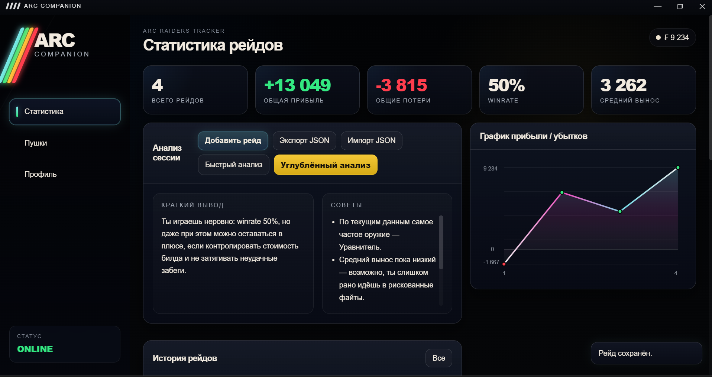
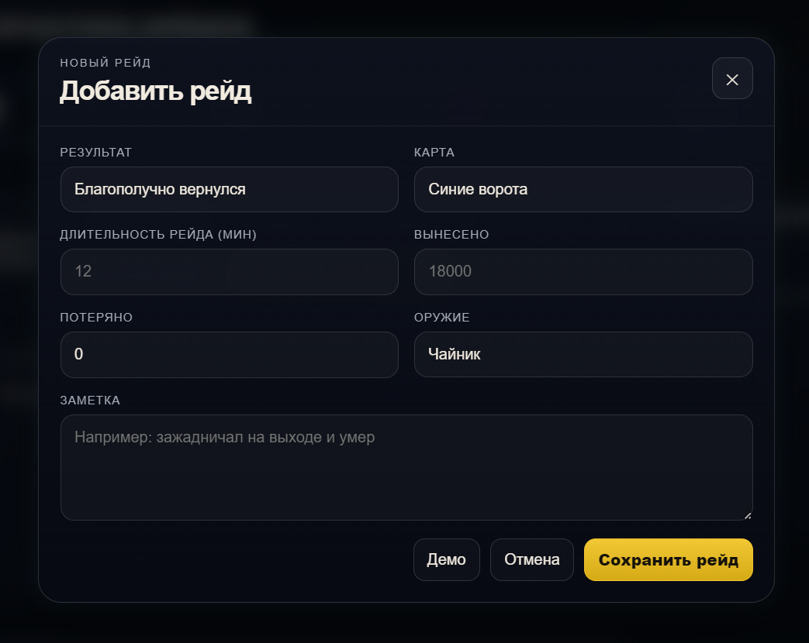
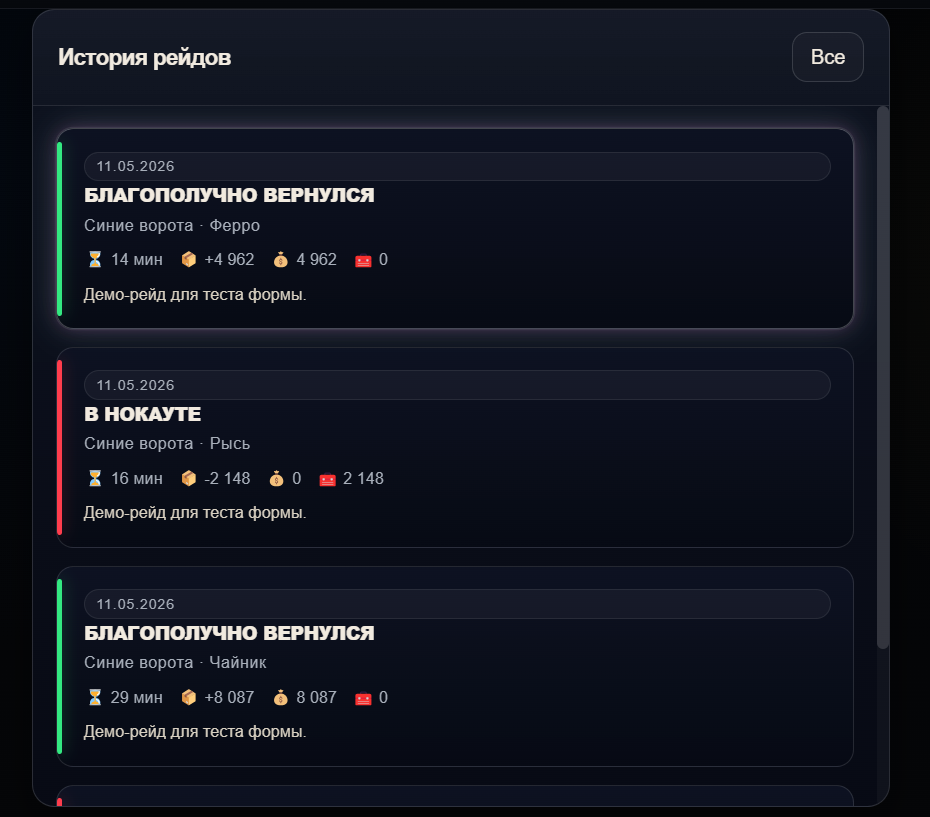
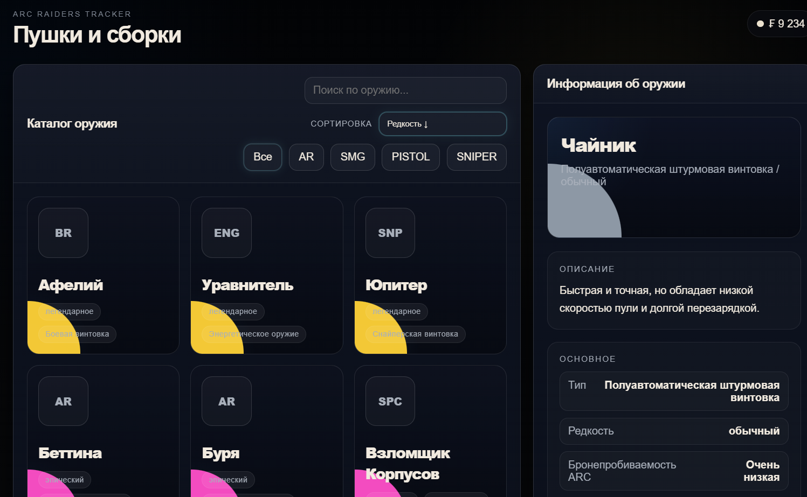
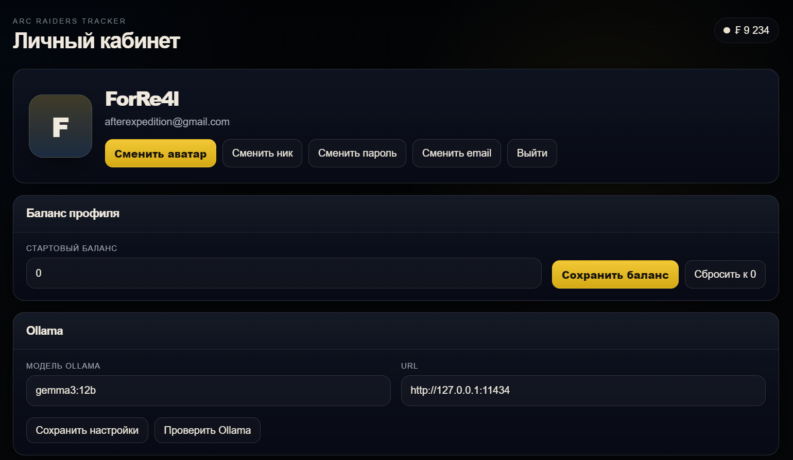

# ARC Companion

Desktop companion application built with Electron and Node.js.

ARC Companion - Это удобное приложения для ведения истории своих рейдов,
проведение анализа с помощью локального ИИ, который на основе твоих рейдов
будет давать дельные советы по улучшению твоего финансового положения)

---

## Features

- Desktop application built with Electron
- Modern UI/UX-oriented interface
- Local desktop interaction
- API and web integration
- Modular project structure
- Custom desktop experience
- Focus on usability and responsiveness

---

## Tech Stack

- Electron
- Node.js
- JavaScript
- HTML/CSS
- REST API

---

## Screenshots

### Main Window


### Add Raid


### History


### Library


### Profile


---

## Installation

```bash
npm install
npm start
